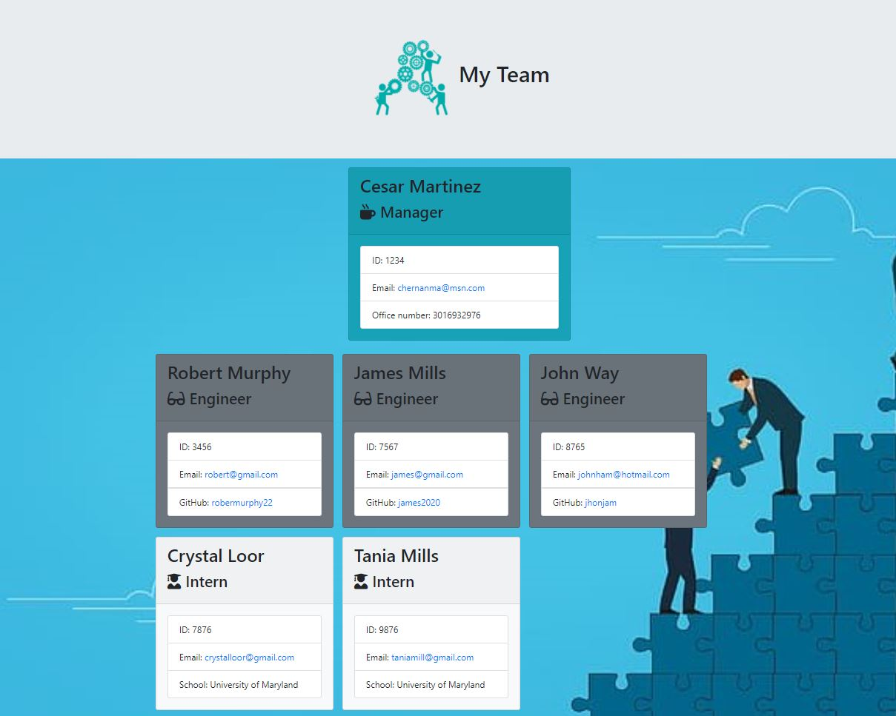

# OOP-Template-Engine-Employee-Summary

In this project, an Employee Summary Template (HTML) is generated base on the user input from a command-line interface (Node CLI). All data entered by the user is validated to ensure the data is clean, correct, and useful.


[Click here to go to Repository](https://github.com/chernanma/OOP-Template-Engine-Employee-Summary)


---
## How it works


[Click here to watch video](https://chernanma.github.io/OOP-Template-Engine-Employee-Summary/video.html)

---

## Criteria 


```
As a manager
I want to generate a webpage that displays my team's basic info
so that I have quick access to emails and GitHub profiles

```

---

## Technologies

- Node.js
- Java Script
- Regex
- Html

### Packages

- Inquirer.js 
- Asciiart.js

---

## Code 

``` JS
/**** app.js******/

const Manager = require("./lib/Manager");
const Engineer = require("./lib/Engineer");
const Intern = require("./lib/Intern");
const inquirer = require("inquirer");
const path = require("path");
const fs = require("fs");
const logo = require('asciiart-logo');
const employeesArr =[];
let noBlankRe= /^(?!\s*$).+/;
//Adding Logo using  Asciiart module
console.log(
    logo({
        name: 'Employee Summary Template',        
        lineChars: 10,
        padding: 2,
        margin: 3,
        borderColor: 'red',
        logoColor: 'bold-red',
        textColor: 'white',
    })
    .emptyLine()
    .right('version 1.0.0')
    .emptyLine()
    .left('by Cesar H Martinez')
    .render()
);

const OUTPUT_DIR = path.resolve(__dirname, "output");
const outputPath = path.join(OUTPUT_DIR, "team.html");

const render = require("./lib/htmlRenderer");
const { ok } = require("assert");
const { isNumber } = require("util");

// Validations //

//Validating Name - not blank 
const valName= async(name)=>{  
  var OK = noBlankRe.exec(name);
  if (!OK){
    return "Name is required!";
  } 
  return true;
  
};

//validation just numbers for ID
const valID= async (id)=>{
  var OK = noBlankRe.exec(id);
  if (!OK || !Number(id)){
    return "ID must contain just numbers";
  }
  return true;
};

function Number(n){
  return !isNaN(parseFloat(n)) && isFinite(n);
}

// Validating correct format for email address 
const valEmail = async (input) => {
  const re = /^(([^<>()[\]\\.,;:\s@\"]+(\.[^<>()[\]\\.,;:\s@\"]+)*)|(\".+\"))@((\[[0-9]{1,3}\.[0-9]{1,3}\.[0-9]{1,3}\.[0-9]{1,3}\])|(([a-zA-Z\-0-9]+\.)+[a-zA-Z]{2,}))$/;
  if (!re.test(input)) {
     return 'Email no valid!, Please enter a correct email address';
  }
  return true;
}; 

//Validating 10 digit phone number
const valPhone = async(number)=>{
  const phoneRegex = /^\(?([0-9]{3})\)?[-. ]?([0-9]{3})[-. ]?([0-9]{4})$/;
  if (!phoneRegex.test(number)) {
    return "Invalid phone number, It must contain 10 digits";
      
  } 
  return true;
};

//Validating no blank for School name
const valSchool = async(school)=>{
  var OK = noBlankRe.exec(school);
  if (!OK){
    return "School Name is required!";
  } 
  return true;

};

//Validating correct github format account 
const valGitHub = async (input) => {
  const re = /\B((?!.*(-){2,}.*)[a-z0-9][a-z0-9-]{0,38}[a-z0-9])/ig;
  if (!re.test(input)) {
     return 'Incorrect asnwer.It is not a valid GitHub username. Format: @valid or @valid-username';
  }
  return true;
}; 


function initialQuestions() {
    inquirer
      .prompt([
        {
            type: "input",
            name: "name",
            message: "What's your manager's name ?",
            validate: valName
        },    
        {
            type: "input",
            name: "id",
            message: "What is your manager's ID ?",
            validate: valID
          },
          {
            type: "input",
            name: "email",
            message: "What is your manager's email ?",
            validate: valEmail
          },
          {
            type: "input",
            name: "number",
            message: "What is your manager's office number ?", 
            validate:valPhone           
          },
          { 
            type: "list",
            name: "type_member",
            message: "What type of team member would would you like to add ? (use arrow keys)",
            choices: ["Engineer","Intern","I don't want to add any more team memeber"]
          },        
      ])
      .then(function(data){
          let manager = new Manager(data.name,data.id,data.email,data.number);
          employeesArr.push(manager);
          if (data.type_member==="Engineer"){
              engineerPrompt();
          }else if(data.type_member==="Intern"){
              internPrompt();
          }else{
            render(employeesArr);   
            fs.rmdirSync("output",{recursive:true,});        
            fs.mkdirSync(path.join(__dirname, "output"));              
            return fs.writeFileSync(outputPath,render(employeesArr));                        
 
          }         
         
      });    
      
  }

  // Prompt to gather information if employee is an Engineer
function engineerPrompt (){
    inquirer
    .prompt([
      {
          type: "input",
          name: "name",
          message: "What's your Engineer name ?",
          validate: valName
      },    
      {
          type: "input",
          name: "id",
          message: "What is your Engineer's ID ?",
          validate: valID
        },
        {
          type: "input",
          name: "email",
          message: "What is your Engineer's email ?",
          validate: valEmail
        },
        {
          type: "input",
          name: "github",
          message: "What is your Engineer's Github username ?",
          validate : valGitHub            
        },
        { 
          type: "list",
          name: "type_member",
          message: "What type of team member would would you like to add ? (use arrow keys)",
          choices: ["Engineer","Intern","I don't want to add any more team memeber"]
        },        
    ])
    .then(function(data){
        let engineer = new Engineer(data.name,data.id,data.email,data.github);
        employeesArr.push(engineer);
        if (data.type_member==="Engineer"){
            engineerPrompt();
        }else if(data.type_member==="Intern"){
            internPrompt();
        }else{
          render(employeesArr);   
          fs.rmdirSync("output",{recursive:true,});        
          fs.mkdirSync(path.join(__dirname, "output"));              
          return fs.writeFileSync(outputPath,render(employeesArr)); 
        }         
    });

}

// Prompt to gather information if employee is an Intern
function internPrompt (){
    inquirer
    .prompt([
      {
          type: "input",
          name: "name",
          message: "What's your Intern name ?",
          validate: valName
         
      },    
      {
          type: "input",
          name: "id",
          message: "What is your Intern's ID ?",
          validate: valID
        },
        {
          type: "input",
          name: "email",
          message: "What is your Intern's email ?",
          validate: valEmail
        },
        {
          type: "input",
          name: "school",
          message: "What is your Intern's school name ?",
          validate: valSchool            
        },
        { 
          type: "list",
          name: "type_member",
          message: "What type of team member would would you like to add ? (use arrow keys)",
          choices: ["Engineer","Intern","I don't want to add any more team memeber"]
        },        
    ])
    .then(function(data){
        let intern = new Intern(data.name,data.id,data.email,data.school);
        employeesArr.push(intern);
        if (data.type_member==="Engineer"){
            engineerPrompt();
        }else if(data.type_member==="Intern"){
            internPrompt();
        }else{
            render(employeesArr);   
            fs.rmdirSync("output",{recursive:true,});        
            fs.mkdirSync(path.join(__dirname, "output"));              
            return fs.writeFileSync(outputPath,render(employeesArr)); 
        }         
    });

    

}

initialQuestions();


```


## Screenshots

### Employee Summary Template Generated




---
## References

- The Node.js fs module, https://nodejs.dev/learn/the-nodejs-fs-module

- npm - Inquirer.js, https://www.npmjs.com/package/inquirer#methods

- Bootstrap - Framework, https://getbootstrap.com/

